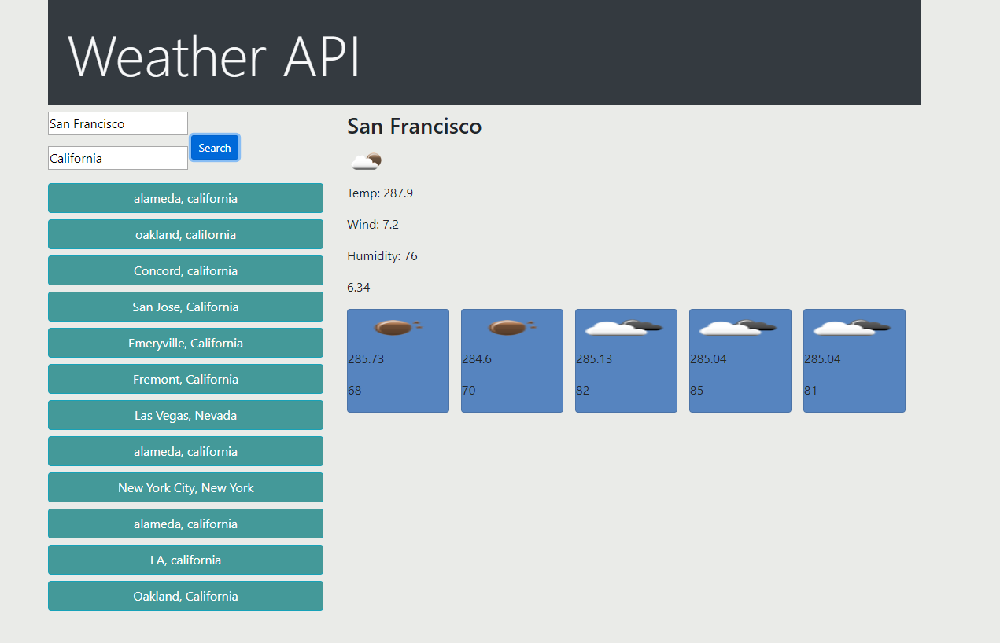

# KERRY SMITH - HOMEWORK 6 - WEATHER API 

Link url (https://kerry-jr.github.io/Homework06/index.html)

                -=-=-=-=- WEATHER API w/ five day forecast -=-=-=-=-=-

# 05 Homework 6- Weather App
...

Homework 06 UCB bootcamp - Created a simple weather app using openweather.com weather api.  Utilizing .ajax I created a weather app that accepts city and state and then display's current day with temp, windspeed, humidity.
## Building the project

Using jQuery and openweather api.

## Troubleshooting

This project presented multiple logistical challenges. Having three seperate API calls and then managing them to all work with each other was difficult at first. Once I understood hoisting and scope it all fell into place.  

## HOW I BUILT AND TECH USED

1.) API
3.) HTML
4.) CSS
5.) JAVASCRIPT
6.) Local storage
7.) Moment.js
8.) jQuery

Screen of app

By: Kerry Smith 04-13-2020 